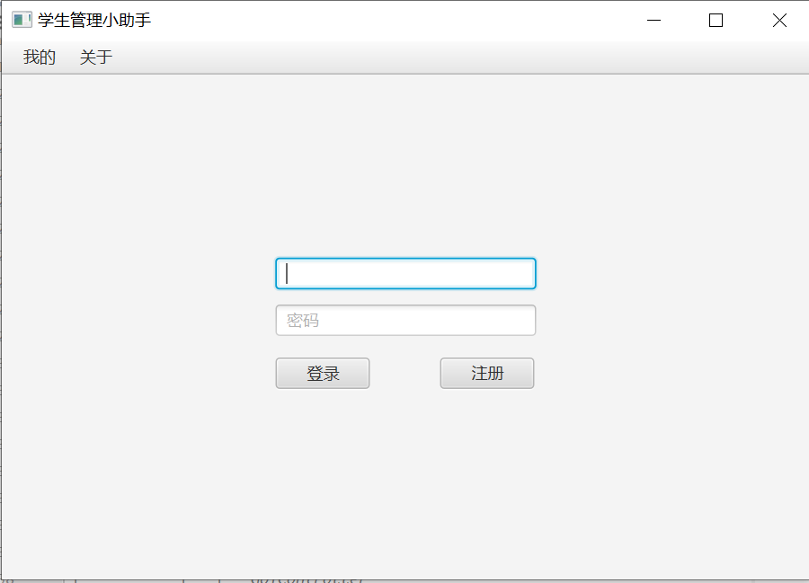
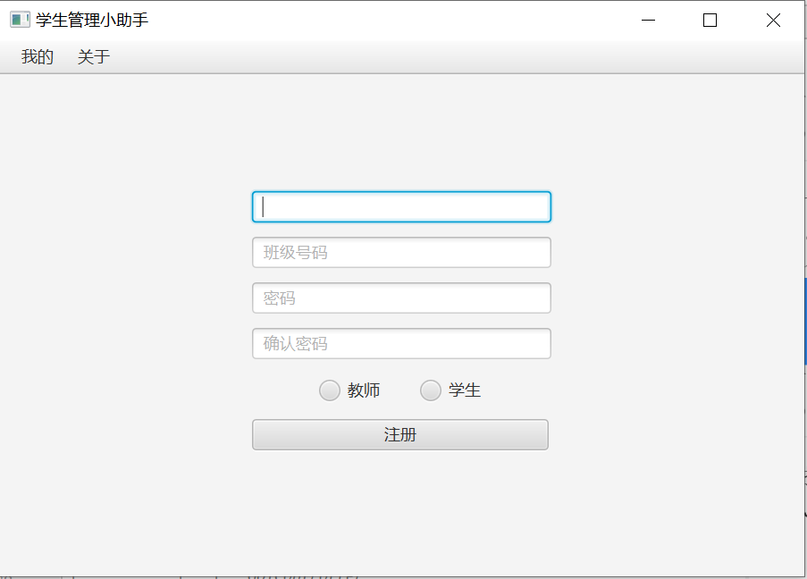
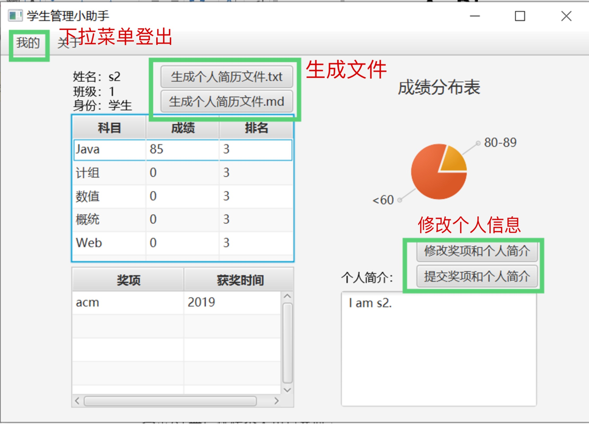
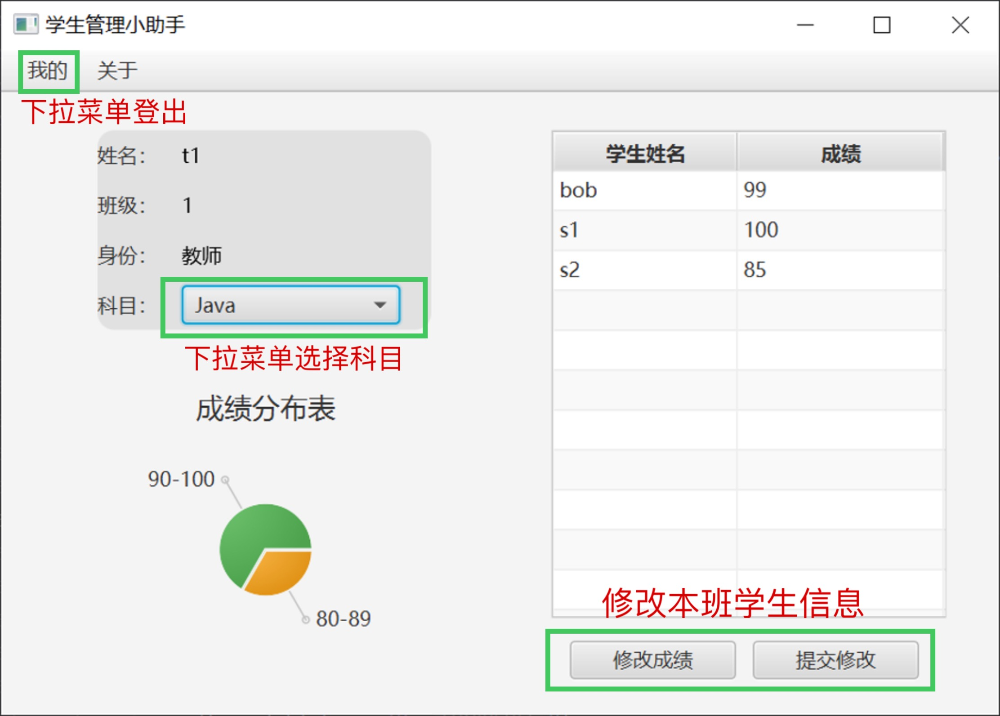
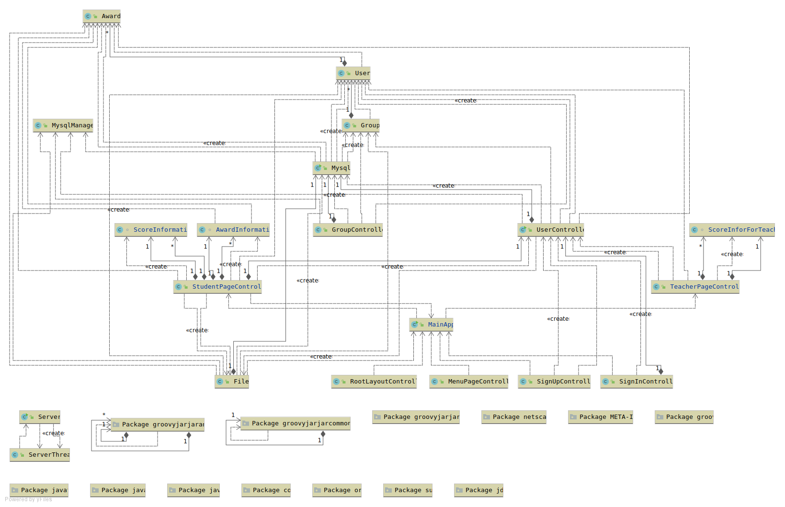
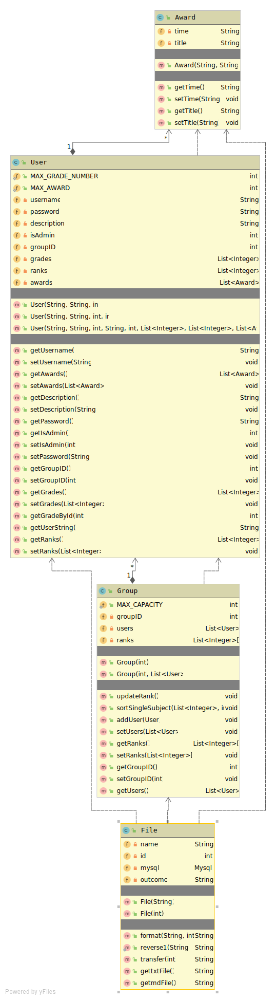
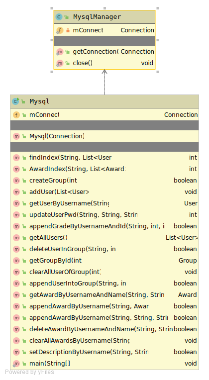
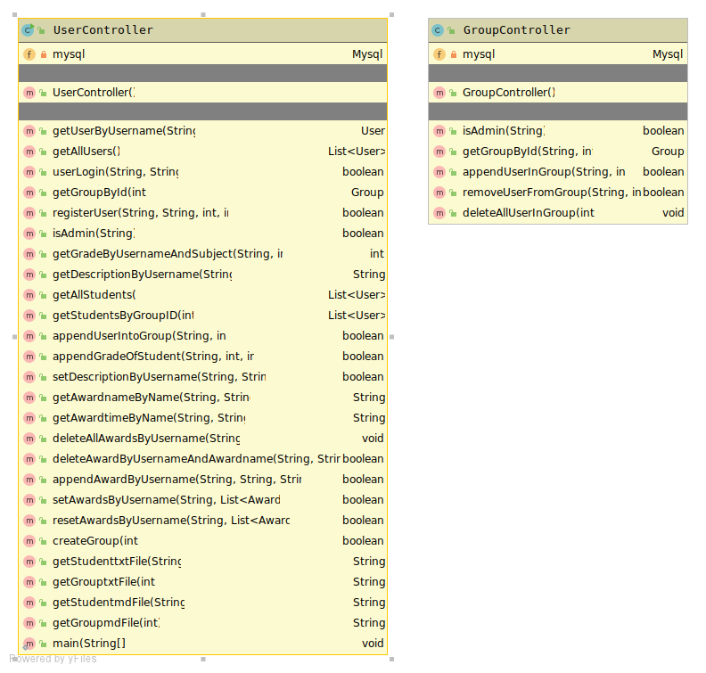
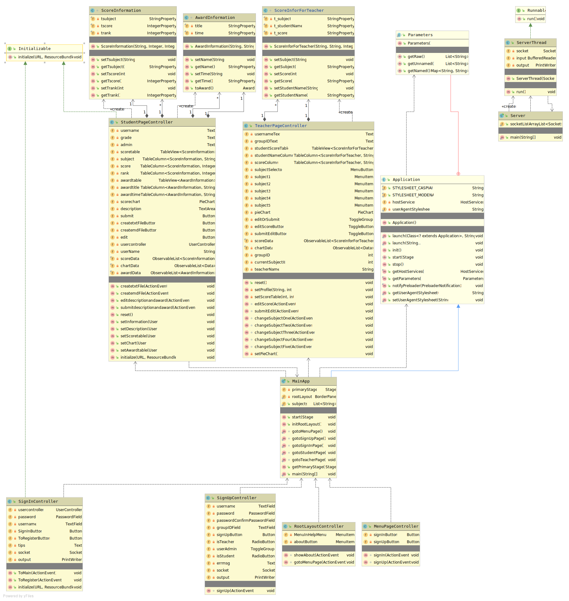

# 项目背景介绍
作为一名学生，我们难免要与学生管理系统打交道。在这次的Java课程项目中，我们便选择了这个主题，试着实现一个基础的学生管理系统。

# 项目环境说明
- 操作系统：Windows 10
- JAVA版本：java 11.0.4

# 系统功能介绍
主要有五个界面，分别是初始界面、登陆界面、注册界面、学生主界面、教师主界面。

进入系统后进入初始界面，可选择登录或注册。如果已经有账号，选择登录，在登录界面，输入姓名和密码，根据账号的身份跳转到学生主界面或教师主界面。如果没有账号，选择注册，在注册界面进行注册，注册后跳转个人页面。

在学生主界面中显示学生的基本信息，如姓名、班级、身份、个人简介、各科成绩和排名、获奖信息。其中个人简介、各科成绩和排名、获奖信息可以更改。如果学生有需要，可以下载有关个人信息的txt或md格式文件，也就是一个简易的简历。

在教师主界面显示教师对应组别的学生成绩信息，按照不同科目进行展示。教师可以对本组学生的成绩信息进行修改，可以查看本组某一科目的成绩分布情况。










# 项目结构说明
- 目录树：
```
.
├── README.md
├── ResumeBuildSystem.iml
├── lib // 项目驱动文件
│   └── mysql-connector-java-8.0.18.jar
├── out
│   └── production
│       └── ResumeBuildSystem
│           ├── Controller 
│           │   ├── GroupController.class 
│           │   └── UserController.class 
│           ├── GUI
│           │   ├── GUIController
│           │   │   ├── AwardInformation.class
│           │   │   ├── MainApp.class
│           │   │   ├── MenuPageController.class
│           │   │   ├── RootLayoutController.class
│           │   │   ├── ScoreInforForTeacher.class
│           │   │   ├── ScoreInformation.class
│           │   │   ├── Server.class
│           │   │   ├── ServerThread.class
│           │   │   ├── SignInController.class
│           │   │   ├── SignUpController.class
│           │   │   ├── StudentPageController.class
│           │   │   └── TeacherPageController.class
│           │   └── view
│           │       ├── MenuPage.fxml
│           │       ├── RootLayout.fxml
│           │       ├── SignInController.fxml
│           │       ├── SignUpController.fxml
│           │       ├── StudentPageController.fxml
│           │       └── TeacherPageController.fxml
│           ├── META-INF
│           │   └── ResumeBuildSystem.kotlin_module
│           ├── database
│           │   ├── Mysql.class 
│           │   └── MysqlManager.class 
│           └── model
│               ├── Award.class
│               ├── File.class
│               ├── Group.class
│               └── User.class
└── src
    ├── Controller// 后台接口
    │   ├── GroupController.java // 群组相关接口
    │   └── UserController.java // 用户相关接口
    ├── GUI
    │   ├── GUIController
    │   │   ├── MainApp.java
    │   │   ├── MenuPageController.java
    │   │   ├── RootLayoutController.java
    │   │   ├── Server.java
    │   │   ├── ServerThread.java
    │   │   ├── SignInController.java
    │   │   ├── SignUpController.java
    │   │   ├── StudentPageController.java
    │   │   └── TeacherPageController.java
    │   └── view
    │       ├── MenuPage.fxml
    │       ├── RootLayout.fxml
    │       ├── SignInController.fxml
    │       ├── SignUpController.fxml
    │       ├── StudentPageController.fxml
    │       └── TeacherPageController.fxml
    ├── database
    │   ├── Mysql.java // 数据库操作接口
    │   └── MysqlManager.java // 数据库连接
    └── model
        ├── Award.java
        ├── File.java
        ├── Group.java
        └── User.java
```

# 系统类图










# 关键模块说明

# 知识点应用说明
## 1. 类和对象
- User
- Group
- File
- Award
- GroupController
- UserController
- Mysql
- MysqlManager
- MainApp
- MenuPageController
- SignUpController
- AwardInformation
- Server
- SignInController
- ServerThread
- RootLayoutController
- ScoreInformation
- StudentPageController
- ScoreInforForTeacher
- TeacherPageController

## 2. 超类与继承
- ServerThread继承Thread类
- MainApp继承Application类

## 3. 接口及其实现
- SignInController实现Initializable接口
- StudentPageController实现Initializable接口

## 4. 异常处理
Mysql、MysqlManager、MainApp、Server、ServerThread、SignInController、SignUpController、StudentPageController、TeacherPageController几个类中均有异常处理。

## 5. 多线程
在界面跳转时使用多线程的方法来传递用户名。跳转前页面的socket的output为用户名，跳转后页面的socket的input为用户名，在ServerThread类中处理。

## 6. 文件存储
学生界面可以生成txt或md文件，并导出到运行的电脑中用户选择的位置。

## 7. 网络编程
在界面的跳转时，通过网络编程实现用户名的传递。即运行Server，跳转时生成两个Socket，第一个output用户名，第二个input用户名。

## 8. Java 图形界面
我们使用JavaFX实现Java图形界面，JavaFX是一个Java库，是一个强大的图形和多媒体处理工具包集合，它允许开发者来设计、创建、测试、调试和部署富客户端程序，并且和Java一样跨平台。

FXML是一种基于XML的声明式标记语言，用于描述JavaFX应用程序的用户界面。通过在FXML中编码或者使用JavaFX Scene Builder来设计图形用户接口（GUI）。

相比Swing，JavaFX的优点有：
1. 绑定Binding，JavaFX新增了Property类，区别在于它可以绑定，UI线程刷新控件时，可以自动读取Property属性所绑定的对应属性的值。
2. Group类，这是一个Swing中没有的容器。它可以通过坐标设置控件位置，而且控件和控件之间可以重叠，更容易实现界面的设计。
3. 支持CSS，因此更容易实现界面的美化。
4. 自带更多动画，界面运行时更加美观。
5. JavaFX提供了将jar和jre打包成exe，双击即可运行。

## 9. Java JDBC
### 后台介绍
该项目的后台采用了mysql作为存储信息的数据库，数据库运行在云服务器上。后台的接口也基本与数据库的增删查改相关。
#### 数据表
##### group表
- 表结构


##### user表
- 表结构


#### 接口文档

##### User
| 序号 | 功能                             | 函数声明                                                               | 解释                                                              |
| ---- | -------------------------------- | ---------------------------------------------------------------------- | ----------------------------------------------------------------- |
| 1    | 判断用户是否在数据库中           | User getUserByUsername(String username)                                | 该用户存在则返回User实体，不存在则返回null                        |
| 2    | 用户登陆                         | boolean userLogin(String username, String password)                    | 登陆成功则返回true，失败则返回false                               |
| 3    | 用户根据用户名和组号注册         | boolean registerUser(String username, String password, int isAdmin)    | 注册成功则返回true，没有则返回false                               |
| 4    | 判断用户是否为管理员             | boolean isAdmin (String username)                                      | 该用户不存在或者不是管理员则返回false，否则返回true               |
| 5    | 将用户加入某个组                 | boolean appendUserIntoGroup (String username, int id)                  | 加入成功则返回true，没有则返回false                               |
| 6    | 根据用户姓名和科目查询成绩       | int getGradeByUsernameAndSubject (String username, int id)             | 返回成绩                                                          |
| 7    | 根据用户姓名查询个人描述         | String getDescriptionByUsername (String username)                      | 返回描述                                                          |
| 8    | 获取全部学生                     | List<User> getAllStudents ()                                           | 获取全部学生列表                                                  |
| 9    | 获取某一个组中的全部学生列表     | List<User> getStudentsByGroupID (int groupID)                          | 获取组中全部学生的列表                                            |
| 10   | 添加学生某门课的成绩             | boolean appendGradeOfStudent (String username, int id, int grade)      | **科目索引从1开始**, 添加成功返回true, 失败返回false              |
| 11   | 为学生添加描述                   | boolean setDescriptionByUsername (String username, String description) | 传入学生姓名，若该用户不为学生或者不存在则返回false, 否则返回true |
| 12   | 根据学生姓名和奖项名获取获奖时间 | String getAwardtimeByName (String username, String awardname)          | 根据学生姓名和奖项名获取获奖时间                                  |
| 13   | 为学生设置奖项                   | boolean setAwardsByUsername (String username, List<Award> awards)      | 设置成功为true, 否则为false                                       |
| 14   | 重置学生奖项并设置               | boolean resetAwardsByUsername (String username, List<Award> awards)    | 传入学生姓名和重置后的奖项, 成功为true, 否则为false               |
| 15   | 获取学生的简历文档               | String getStudentFile (String username)                                | 传入学生姓名, 获取简历字符串                                      |
##### Group
| 序号 | 功能                | 函数声明                                            | 解释                                   |
| ---- | ------------------- | --------------------------------------------------- | -------------------------------------- |
| 1    | 根据id获取group信息 | Group getGroupById (String username, int id)        | 传入id, 要验证                         |
| 2    | 根据学生姓名        | boolean appendUserInGroup (String username, int id) | 传入学生姓名和组号，该学生和组需要存在 |
|      |                     |                                                     |                                        |

# 创新点或技术难点说明
- 创新点：
    1. 加入了简历导出功能
- 技术难点：
    1. 网路上关于JavaFX的中文资料比较少
# 存在未解决的问题点或者难点讨论
1. 导出的简历我们原本希望做成一份pdf的格式，受文件本身格式所限，txt和md格式的文件，虽然可以清楚展现学生的情况，但美观度不足。但由于pdf文件的生成基本是通过一个Java库iText，这个库是付费使用的，所以遗憾

2. 原本希望利用JavaFX可以打包成exe的特点，进一步方便使用，然而我们使用的Java11不支持build artifact，没能展现出JavaFX这一优势。
# 其它
